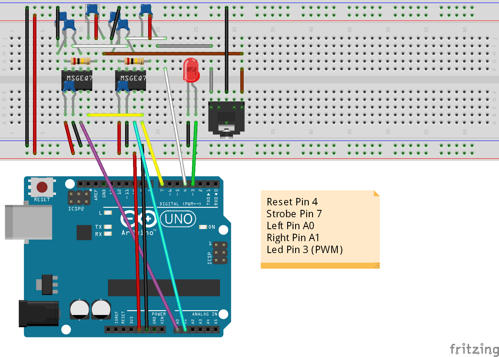

MSGEQ7 library
==============


Reads MSGEQ7 IC with 7 different frequencies from range 0-255

63Hz, 160Hz, 400Hz, 1kHz, 2.5kHz, 6.25KHz, 16kHz

Examples included:
* Led: blinks led, shows basic usage
* Serial: shows spectrum via serial. Shows how to use a mono input
* FastLED: blinks led strip with different frequencies. Shows how to use different syntax

More projects/contact:
http://nicohood.wordpress.com/

Hardware setup
==============
See the [datasheet](https://www.sparkfun.com/datasheets/Components/General/MSGEQ7.pdf) for more information.



Additional Information
======================
Have a look at the library itself, its not so complicated.
But keep attention to the LOW and HIGH setting of strobe and reset

Keep in mind that the smoothed value is created from the last 5(by default) reads.
If you analze every 20ms this means the last 20*5=100 ms time period actually is analyzed.
I found out that reading every 20ms is a good value to start.

You can reset the IC with myMSGEQ7.reset() but you dont need that normally.

If you only want to use mono mode or one IC just connect the two inputs together to the MSGEQ7
and only use one analog input. Have a look at the Serial example of the library.

The Output only ranges from 0-255 for saving memory and for easy use. It doesnt matter much.
If you still want to read up to 1023 remove the divide >> 2 in the library and use uint16_t

The IC has a standard value at about 10. You should keep that in mind.
In this case the Led always glims a bit. Have a look at the map() function to improve this.

Version History
===============
```
1.1 Release (10.07.2014)
* changed syntax
* optimized performance
* added more examples

1.0 Release (13.04.2014)
*added general functionality
```

Licence and Copyright
=====================
If you use this library for any cool project let me know!

```
Copyright (c) 2014 NicoHood
See the readme for credit to other people.

Permission is hereby granted, free of charge, to any person obtaining a copy
of this software and associated documentation files (the "Software"), to deal
in the Software without restriction, including without limitation the rights
to use, copy, modify, merge, publish, distribute, sublicense, and/or sell
copies of the Software, and to permit persons to whom the Software is
furnished to do so, subject to the following conditions:

The above copyright notice and this permission notice shall be included in
all copies or substantial portions of the Software.

THE SOFTWARE IS PROVIDED "AS IS", WITHOUT WARRANTY OF ANY KIND, EXPRESS OR
IMPLIED, INCLUDING BUT NOT LIMITED TO THE WARRANTIES OF MERCHANTABILITY,
FITNESS FOR A PARTICULAR PURPOSE AND NONINFRINGEMENT. IN NO EVENT SHALL THE
AUTHORS OR COPYRIGHT HOLDERS BE LIABLE FOR ANY CLAIM, DAMAGES OR OTHER
LIABILITY, WHETHER IN AN ACTION OF CONTRACT, TORT OR OTHERWISE, ARISING FROM,
OUT OF OR IN CONNECTION WITH THE SOFTWARE OR THE USE OR OTHER DEALINGS IN
THE SOFTWARE.
```