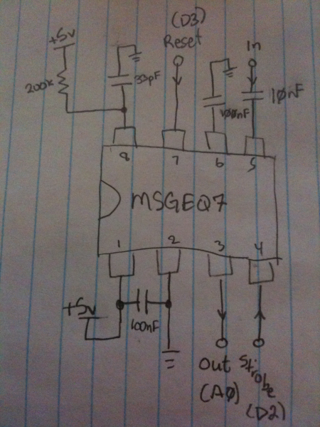
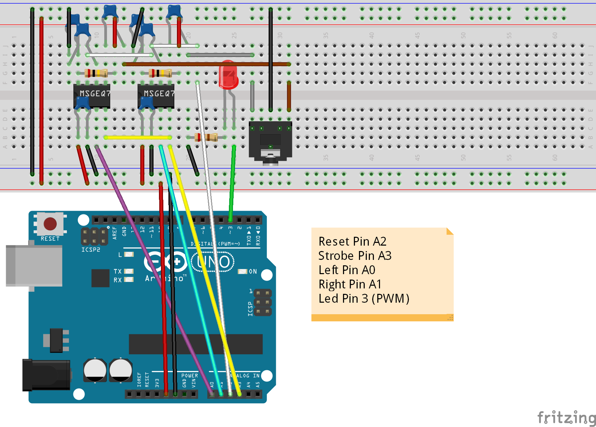
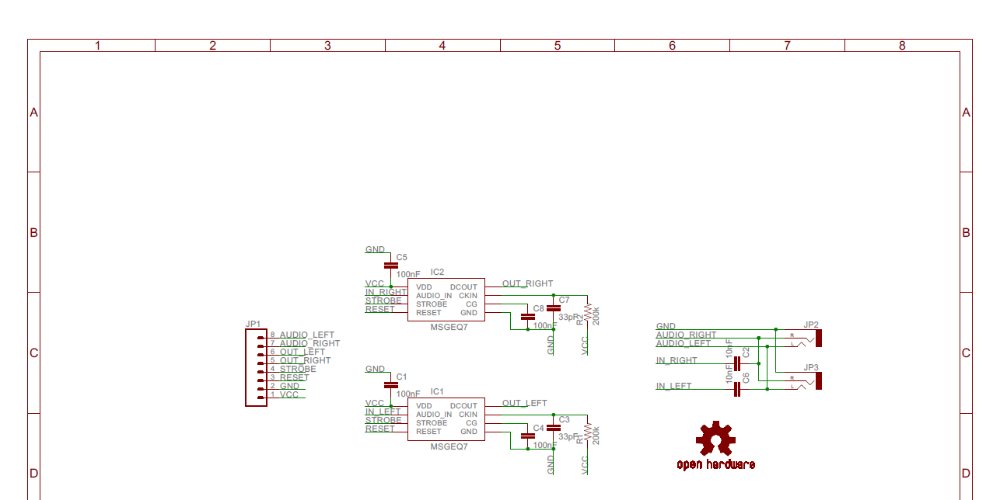
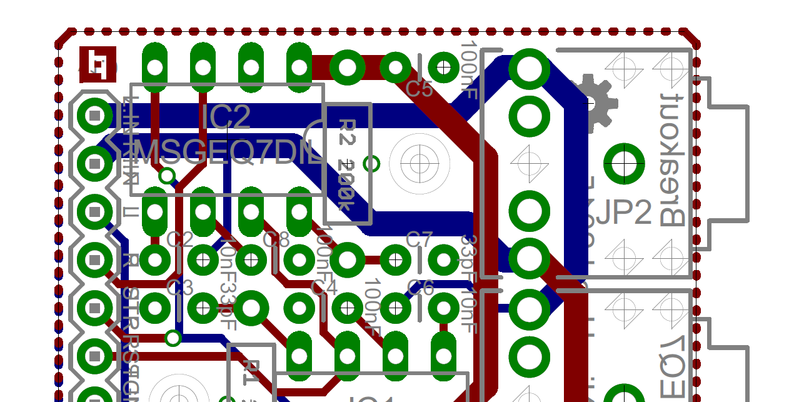

MSGEQ7 Library 1.2 + Board v1.0
===============================


The MSGEQ7 is an IC designed to analyze music on different frequencies.
This library reads the MSGEQ7 with 7 different frequencies from range 0-255, stereo or mono.
It can be used to visualize audio through Leds for example.
This repository also includes the source of an [breakout board](https://github.com/NicoHood/MSGEQ7/tree/dev#breakout-board).

The frequencies are:
63Hz, 160Hz, 400Hz, 1kHz, 2.5kHz, 6.25KHz, 16kHz

**Examples included:**
* Led: blinks led, shows basic usage
* Serial: shows spectrum via serial and how to use a mono input
* FastLED: blinks led strip with different frequencies. Shows how to use different syntax.
Uses [FastLED library](https://github.com/FastLED/FastLED)

**Todo:**
* Left Right -> Stereo
* Update pins of examples
* board pictures + breadboard
* New header pic?
* update additional information readme
* API documentation (add to SW installation section)
* optional 10 bit resolution?
* different smooth code
* update pcb + schematic image with a lager monitor..

More projects/contact:
http://www.NicoHood.de


Hardware Setup
==============
To use the MSGEQ7 you first need a few other parts and connect them properly.
Make sure the 33pF capacitor and the 200k Ohm resistor are precise.
Otherwise the frequencies may be off.
See the [data sheet](https://www.sparkfun.com/datasheets/Components/General/MSGEQ7.pdf) for more information.

#####Required parts (stereo):
* 2x [MSGEQ7 IC](https://www.sparkfun.com/products/10468)
* 1x [Audio Jack 3.5mm](https://www.sparkfun.com/products/8032) (or any other audio input)
* 2x 10nF Capacitor
* 4x 100nF Capacitor
* 2x 33pF Capacitor
* 2x 200k Ohm Resistor

#####Optional parts
* 1x [Audio Jack 3.5mm](https://www.sparkfun.com/products/8032) (as audio output)
* Led or Led strips
* 1x 220 Ohm Resistor (for Led)

###Breadboard Setup
This would be an example breadboard setup for the Led example.






Software installation
=====================
Install the library as you are used to.
More information can be found [here](http://arduino.cc/en/guide/libraries).


Breakout Board
==============
The MSGEQ7 Breakout Board lets you easily hook up an audio source or microphone to your microcontroller.
You may also use a 2nd audio output to pass the audio signal to music boxes again.
You can solder a 6 or 8 pin header to the board and connect it to a breadboard for example.
It is fully open source so you can create a copy for yourself or modify it.

#####Features:
* Stereo music analyze
* Audio input via 3.5mm Jack
* Additional audio output
* Additional audio in/output via pin header
* Mounting holes
* Breadboard compatible
* Easy to solder (DIP parts)
* [Open Source Hardware](http://www.oshwa.org/definition/)

#####Files:
You can find all needed files in the [board](board/) folder.
Click view raw to download the PDF files.

#####Schematic


#####PCB



Additional Information
======================
Have a look at the library itself, its not so complicated.
But keep attention to the LOW and HIGH setting of strobe and reset

Keep in mind that the smoothed value is created from the last 5(by default) reads.
If you analyze every 20ms this means the last 20*5=100 ms time period actually is analyzed.
I found out that reading every 20ms is a good value to start.

You can reset the IC with myMSGEQ7.reset() but you dont need that normally.

If you only want to use mono mode or one IC just connect the two inputs together to the MSGEQ7
and only use one analog input. Have a look at the Serial example of the library.

The Output only ranges from 0-255 for saving memory and for easy use. It doesnt matter much.
If you still want to read up to 1023 remove the divide >> 2 in the library and use uint16_t

The IC has a standard value at about 10. You should keep that in mind.
In this case the Led always glims a bit. Have a look at the map() function to improve this.

Version History
===============
```
1.2 Release (xx.xx.2014)
* Added breakout board files v1.0
* Optimized performance
* Improve examples

1.1 Release (10.07.2014)
* Changed syntax
* Optimized performance
* Added more examples

1.0 Release (13.04.2014)
* Added general functionality
```

License and Copyright
=====================
If you use this library for any cool project let me know!

```
Copyright (c) 2014-2015 NicoHood

Permission is hereby granted, free of charge, to any person obtaining a copy
of this software and associated documentation files (the "Software"), to deal
in the Software without restriction, including without limitation the rights
to use, copy, modify, merge, publish, distribute, sublicense, and/or sell
copies of the Software, and to permit persons to whom the Software is
furnished to do so, subject to the following conditions:

The above copyright notice and this permission notice shall be included in
all copies or substantial portions of the Software.

THE SOFTWARE IS PROVIDED "AS IS", WITHOUT WARRANTY OF ANY KIND, EXPRESS OR
IMPLIED, INCLUDING BUT NOT LIMITED TO THE WARRANTIES OF MERCHANTABILITY,
FITNESS FOR A PARTICULAR PURPOSE AND NONINFRINGEMENT. IN NO EVENT SHALL THE
AUTHORS OR COPYRIGHT HOLDERS BE LIABLE FOR ANY CLAIM, DAMAGES OR OTHER
LIABILITY, WHETHER IN AN ACTION OF CONTRACT, TORT OR OTHERWISE, ARISING FROM,
OUT OF OR IN CONNECTION WITH THE SOFTWARE OR THE USE OR OTHER DEALINGS IN
THE SOFTWARE.
```