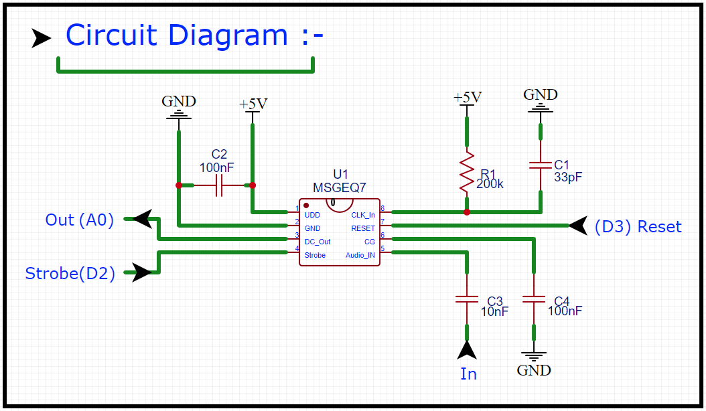
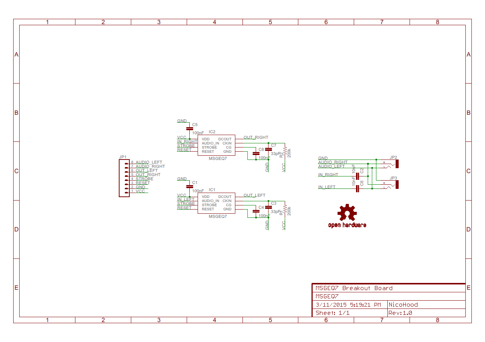
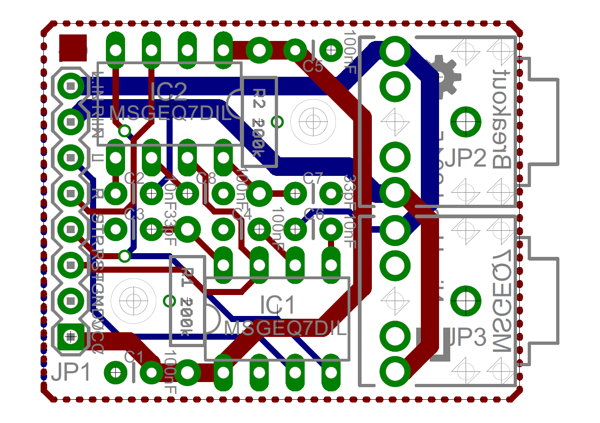

MSGEQ7 Library 1.2.2 + Board v1.0
=================================


The MSGEQ7 library provides an interface to an arbitrary number of MSGEQ7 chips, to convert analog voltage output from the chips to digital data. The data is of values from 0 to 255 (8 bits). Output from each chip, which is input to the library, is referred to in the documentation for this library as a "channel".

The MSGEQ7 is an IC designed to analyze sound (actually, any signal of varying voltages; in the case of sound or music, a signal as from a microphone). The chip measures aspects of input in seven frequency bands, and can provide output related to one (at a time) of these bands as an analog DC voltage signal. The frequency bands the chip analyzes are centered on: 63, 160, 400, 1K, 2.5K, 6.25K, and 16K Hertz.

This repository also includes source information for a [Breakout Board](#breakout-board) with two MSGEQ7 chips. In a case of using two channels of output from a breakout board, referring to one channel as "mono" and two channels as "stereo" makes sense.

<a href="https://www.buymeacoffee.com/nicohood" target="_blank"></a>

#### Features
* IDE 1.6.x with every Arduino compatibly
* [Sparkfun Spectrum Shield](https://www.sparkfun.com/products/13116) compatible
* Reads 1-n MSGEQ7 sensors
* Compact and fast implementation
* More compact and flexible 8 bit resolution
* Optional 10 bit resolution
* Value smoothing
* Tools to reduce noise
* A [Breakout Board](#breakout-board).

#### Examples included:
* Led: blinks led, shows basic usage
* Serial: shows spectrum via serial and how to use more channels
* FastLED: blinks led strip with different frequencies. Shows how to use different syntax.
Uses [FastLED library](https://github.com/FastLED/FastLED)

# Table of Contents
1. [Hardware](#hardware)
  * [Breadboard](#breadboard)
  * [Breakout Board](#breakout-board)
2. [Software](#software)
  * [Library Installation](#library-installation)
  * [API Documentation](#api-documentation)
3. [Contact](#contact)
4. [Version History](#version-history)
5. [License and Copyright](#license-and-copyright)

# Hardware

## Breadboard
To use the MSGEQ7 you first need a few other parts and connect them properly.
Make sure the 33pF capacitor and the 200k Ohm resistor are precise. Otherwise
the frequencies may be off. See the
[data sheet](https://www.sparkfun.com/datasheets/Components/General/MSGEQ7.pdf)
for more information.

Additionally this repository also contains a full instruction of how to build
your own MSGEQ7 [Breakout Board](#breakout-board).

##### Required parts (stereo):
* 2x [MSGEQ7 IC](https://www.sparkfun.com/products/10468)
* 1x [Audio Jack 3.5mm](https://www.sparkfun.com/products/8032)
  (or any other audio input)
* 2x 10nF Capacitor
* 4x 100nF Capacitor
* 2x 33pF Capacitor
* 2x 200k Ohm Resistor
* Led or Led strips
* 1x 220 Ohm Resistor (for Led)

### Breadboard Setup
This would be an example breadboard setup for the Led example.




## Breakout Board
The MSGEQ7 Breakout Board lets you easily hook up an audio source or microphone
to your microcontroller. You may also use a 2nd audio output to pass the audio
signal to music boxes again. You can solder a 6 or 8 pin header to the board and
connect it to a breadboard for example. It is fully open source so you can
create a copy for yourself or modify it.


##### Features:
* Stereo music analyze
* Audio input via 3.5mm Jack
* Additional audio output
* Additional audio in/output via pin header
* Mounting holes
* Breadboard compatible
* Easy to solder (DIP parts)
* [Open Source Hardware](http://www.oshwa.org/definition/)

##### Required parts:
* 1x Breakout Board
* 2x [MSGEQ7 IC](https://www.sparkfun.com/products/10468)
* 2x [Audio Jack 3.5mm](https://www.sparkfun.com/products/8032)
* 8 Pin Header Male
* 2x IC Socket 8 Pins (optional)
* 2x 10nF Capacitor
* 4x 100nF Capacitor
* 2x 33pF Capacitor
* 2x 200k Ohm Resistor


### Files:
You can find all needed files in the [board](extras/board/) folder.
Click view raw to download the PDF files.

### Schematic


### PCB


### Soldering the board
You need to cut off the area around the audio jack a bit first to fit them
better. A knife will work best here. After this just solder all components,
starting with the capacitors and resistors to the IC sockets, the audio jacks
and pin header. Any beginner can do this, no SMD component is used.


# Software

## Library Installation
Install the library as you are used to.
More information can be found [here](http://arduino.cc/en/guide/libraries).

## API Documentation

For a very fast library example see the
[MSGEQ7_LED example](/examples/MSGEQ7_LED/MSGEQ7_LED.ino).

### Create MSGEQ7 Object

Every `CMSGEQ7` instance needs pins passed via template to optimize the code.

The reset and strobe pin can be any digital pin on the board. Those are
connected to each MSGEQ7 IC in parallel. You can input as many analog pins as
you have MSGEQ7 ICs. For example only use a single IC for mono mode, 2 for
stereo or more for surround.

If you want to smooth the readings with the last reading pass 0-255 as
first argument. 0 Will disable smoothing, 255 will take 100% of the previous
value. 191-223 is suggested if smoothing is desired.

**Function Prototype:**
```cpp
template <uint8_t smooth, uint8_t resetPin, uint8_t strobePin
          uint8_t firstAnalogPin, uint8_t ...analogPins>
class CMSGEQ7;
```

**Examples:**
```cpp
// Single MSGEQ7 IC, Smoothing enabled (75%)
CMSGEQ7<191, 6, 4, A0> MSGEQ7;

// Two MSGEQ7 ICs (stereo), Smoothing disabled (0%)
CMSGEQ7<0, 6, 4, A0, A1> MSGEQ7;
```

### Initialize MSGEQ7 ICs
Do whatever is required to initialize the ICs and resets it.

**Function Prototype:**
```cpp
void begin(void);
```

**Example:**
```cpp
void setup() {
  // This will set the ICs ready for reading
  MSGEQ7.begin();
}
```

### Read MSGEQ7 ICs
Basic read function. Reads all channels and saves value inside the buffer. You
can access the buffer with the `get()` function. Up to 400FPS (on 16MHz) are
possible with 2 channels from what I've measured.

To automatically read every X seconds you may also use the 2nd function. Used
together with the `ReadsPerSecond(f)` makro you can simply pass an FPS interval
to the reading function. The return value tells you if a new reading was made.

**Function Prototypes:**
```cpp
bool read(void);
bool read(const uint32_t interval);
```

**Examples:**
```cpp
#define MSGEQ7_INTERVAL ReadsPerSecond(50)

void loop() {
  // Analyze MSGEQ7 ICs now. Will always return true.
  bool newReading = MSGEQ7.read();

  // Analyze without delay every interval
  bool newReading = MSGEQ7.read(MSGEQ7_INTERVAL);
}
```

### Reset MSGEQ7 ICs
Resets ICs, so they start reading at 0 again. Normally this is **not required**
since it is done in the `read()` function.

**Function Prototype:**
```cpp
void reset(void);
```

**Example:**
```cpp
void loop() {
  // Reset the IC frequently, otherwise it will get out of sync after a while
  MSGEQ7.reset();
}
```

### Get MSGEQ7 ICs Frequency
Returns the data of the selected frequency and channel. By default this returns
an `uint8_t` value, for 10bit resolution `uint16_t`. Frequency values should be
0-6 where 0 is the lowest frequency (Bass) and 6 the highest.

Depending on how many analog pins you have attached you can select the channel
here (0-n). You can also leave out the channel variable to get an average value
of all channels.

The output only ranges from 0-255 to save memory and use it easier. You won't
lose much information anyways. If you still want to use 10bit mode see
[makros](#makros)

The IC has a standard noise at about 10-19. You should keep that in mind. Have a
look at the [Map Noise](#map-noise) function to get rid of this.

**Function Prototypes:**
```cpp
MSGEQ7_data_t get(const uint8_t frequency, const uint8_t channel);
MSGEQ7_data_t get(const uint8_t frequency);
```

**Examples:**
```cpp
void loop() {
  // Read bass frequency (of all channels)
  uint8_t input = MSGEQ7.get(MSGEQ7_BASS);

  // Read mid frequency (of channel 0)
  uint8_t input = MSGEQ7.get(MSGEQ7_MID, 0);
}
```

### Get MSGEQ7 ICs Volume
Returns the overall volume of all frequencies of a channel. By default this
returns an `uint8_t` value, for 10bit resolution `uint16_t`. The volume however
is **not that useful** actually.

Depending on how many analog pins you have attached you can select the channel
here (0-n). You can also leave out the channel variable to get an average volume
of all channels.

**Function Prototypes:**
```cpp
MSGEQ7_data_t getVolume(uint8_t channel);
MSGEQ7_data_t getVolume(void);
```

**Examples:**
```cpp
void loop() {
  // Read volume (of all channels)
  uint8_t input = MSGEQ7.getVolume();

  // Read volume (of channel 0)
  uint8_t input = MSGEQ7.getVolume(0);
}
```

### Terminate Reading MSGEQ7 ICs
Sets pins to input again to safely remove connections. This is **normally not
required**.

**Function Prototype:**
```cpp
void begin(void);
```

**Example:**
```cpp
void setup() {
  // This will set the ICs pin to input again
  MSGEQ7.end();
}
```

### Map Noise
Normally when using MSGEQ7 you get a background noise of around 15-19 (8bit
mode) even if no music is played. To get rid of this you can use the
`mapNoise()` function to get rid of this. This macro can be used to remap the
input.

You can leave out the last 4 arguments, they will be replaced with default
values. See [makros](#makros) for more information. For 10 bit resolution the
function uses `uint16_t` and 1023 as default maximum value.

**Function Prototype:**
```cpp
inline MSGEQ7_data_t mapNoise(MSGEQ7_data_t x,
                              MSGEQ7_data_t in_min = MSGEQ7_IN_MIN,
                              MSGEQ7_data_t in_max = MSGEQ7_IN_MAX,
                              MSGEQ7_data_t out_min = MSGEQ7_OUT_MIN,
                              MSGEQ7_data_t out_max = MSGEQ7_OUT_MAX);
```

**Example:**
```cpp
void loop() {
  // Remove noise from input
  input = mapNoise(input);
}
```


### Makros
Inside `MSGEQ7.h` some predefined makros are used to make code writing simpler.
You can optionally also enable 10 bit reading mode (0-1024) if you like to.
For most up to date definitions see `MSGEQ7.h` source file.

```cpp
// Software version
#define MSGEQ7_VERSION 121

// Use (optional) full 10 bit analog readings for MSGEQ7
//#define MSGEQ7_10BIT

// FPS makro
#define ReadsPerSecond(f) (1000000UL / (f))

// Basic frequencies definitions (0-6 valid, 7 channels)
#define MSGEQ7_0 0
#define MSGEQ7_1 1
#define MSGEQ7_2 2
#define MSGEQ7_3 3
#define MSGEQ7_4 4
#define MSGEQ7_5 5
#define MSGEQ7_6 6
#define MSGEQ7_BASS 0
#define MSGEQ7_LOW 0
#define MSGEQ7_MID 3
#define MSGEQ7_HIGH 5

// Resolution dependant settings
#ifdef MSGEQ7_10BIT
typedef uint16_t MSGEQ7_data_t;
#define MSGEQ7_IN_MIN 20
#define MSGEQ7_IN_MAX 1023
#define MSGEQ7_OUT_MIN 0
#define MSGEQ7_OUT_MAX 1023
#else
typedef uint8_t MSGEQ7_data_t;
#define MSGEQ7_IN_MIN 20
#define MSGEQ7_IN_MAX 255
#define MSGEQ7_OUT_MIN 0
#define MSGEQ7_OUT_MAX 255
#endif
```

Contact
=======

Contact information can be found here:

www.nicohood.de


Version History
===============
```
1.2.2 Release (16.04.2016)
* Fixed mapNoise() example and keyword #4

1.2.1 Release (05.03.2016)
* Added 1.6.x library schema
* Added board pictures
* Fix reading the wrong frequency over time
* Smooth from 0-255 now
* Fix compiler warnings
* Renamed map function, moved outside the main class
* Improved documentation

1.2 Release (23.04.2015)
* Added breakout board files v1.0
* Optimized performance
* Variable number of ICs readable
* Added optional 10bit resolution
* Added more functions/tools
* Improved examples
* Added MSGEQ7_VERSION definition
* Added library.properties

1.1 Release (10.07.2014)
* Changed syntax
* Optimized performance
* Added more examples

1.0 Release (13.04.2014)
* Added general functionality
```


License and Copyright
=====================
If you use this library for any cool project let me know!

```
Copyright (c) 2014-2016 NicoHood

Permission is hereby granted, free of charge, to any person obtaining a copy
of this software and associated documentation files (the "Software"), to deal
in the Software without restriction, including without limitation the rights
to use, copy, modify, merge, publish, distribute, sublicense, and/or sell
copies of the Software, and to permit persons to whom the Software is
furnished to do so, subject to the following conditions:

The above copyright notice and this permission notice shall be included in
all copies or substantial portions of the Software.

THE SOFTWARE IS PROVIDED "AS IS", WITHOUT WARRANTY OF ANY KIND, EXPRESS OR
IMPLIED, INCLUDING BUT NOT LIMITED TO THE WARRANTIES OF MERCHANTABILITY,
FITNESS FOR A PARTICULAR PURPOSE AND NONINFRINGEMENT. IN NO EVENT SHALL THE
AUTHORS OR COPYRIGHT HOLDERS BE LIABLE FOR ANY CLAIM, DAMAGES OR OTHER
LIABILITY, WHETHER IN AN ACTION OF CONTRACT, TORT OR OTHERWISE, ARISING FROM,
OUT OF OR IN CONNECTION WITH THE SOFTWARE OR THE USE OR OTHER DEALINGS IN
THE SOFTWARE.
```
